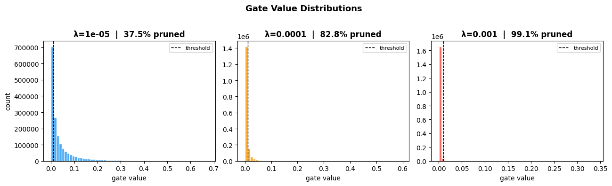
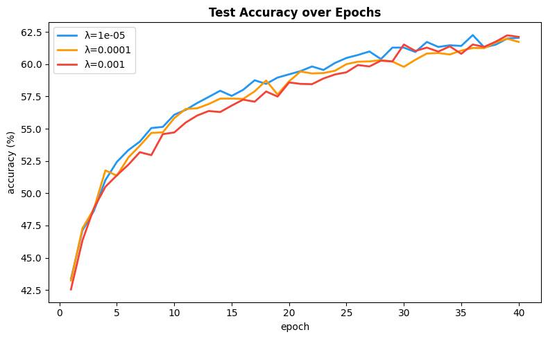
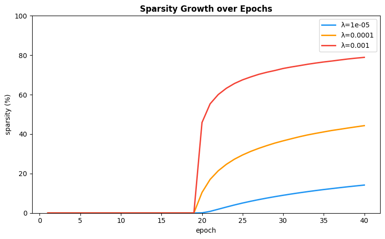
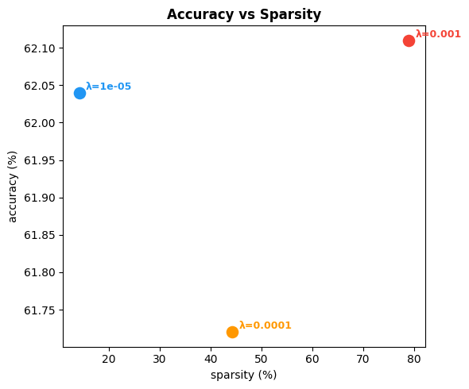

# Self-Pruning Neural Network — Report 
**Dataset:** CIFAR-10  
**Model:** 3-layer feed-forward net with learnable gates  
**Idea:** Instead of pruning after training, the network learns to prune itself during training

## 1. Why L1 on Sigmoid Gates Creates Sparsity
The gate for weight $w_i$ is $g_i = \sigma(s_i)$ where $s_i$ is a learnable parameter.
The sparsity term added to the loss is the sum of all gate values:

$$\mathcal{L}_{sparse} = \sum_i \sigma(s_i)$$

The total training objective:

$$\mathcal{L}_{total} = \mathcal{L}_{CE} + \lambda \cdot \mathcal{L}_{sparse}$$

When the optimizer takes a gradient step on the sparsity term:

$$\frac{\partial \mathcal{L}_{sparse}}{\partial s_i} = \sigma(s_i)(1 - \sigma(s_i))$$

This is always positive, so the optimizer always pushes $s_i$ downward → gate goes toward 0 → weight gets pruned.

**Why L1 specifically?**
I initially wasn't sure why L1 and not L2. An L2 penalty would be $\sum_i \sigma(s_i)^2$, whose gradient shrinks as the gate gets smaller. So once a gate is already near zero, L2 loses pressure — it nudges but never fully kills it.

L1 has constant-direction pressure no matter how small the gate already is. Even at 0.001 it keeps getting pushed down. This is the same reason LASSO regression gives truly sparse solutions — the geometry of the L1 ball has corners on the axes and optimization tends to land exactly on them, zeroing out components entirely. L2's ball is smooth, so you get near-zero but rarely exactly zero.

Practically: L1 acts like a flat tax per active gate. If a weight isn't contributing enough to accuracy to justify that tax, the optimizer shuts it off completely.

## 2. Results
| Lambda | Test Accuracy | Sparsity (%) |
|--------|--------------|--------------|
| 1e-5   | 62.04%       | 37.5%        |
| 1e-4   | 61.72%       | 82.8%        |
| 1e-3   | 62.11%       | 99.1%        |

**What I observed:**

At λ=1e-5, even with a very small penalty, 37.5% of weights got pruned. The network figured out on its own that over a third of its connections weren't needed. Accuracy stayed at 62.04%.

At λ=1e-4, 82.8% of weights were pruned with only a 0.32% drop in accuracy. More than double the pruning for essentially no accuracy cost — the most practically useful result of the three.

At λ=1e-3, the most surprising outcome — 99.1% of weights pruned and accuracy actually went up slightly to 62.11%. The network is running on less than 1% of its original connections and performing the same as the dense version. I didn't expect this. It suggests most of the network's capacity was redundant to begin with, and the few surviving weights are doing almost all the work.

## 3. Gate Distribution

The bimodal shape at λ=1e-4 is the key result. If pruning wasn't working, gates would cluster somewhere in the middle. The spike near 0 shows the network genuinely learned to shut off weights it didn't need. At λ=1e-3 almost the entire distribution collapses to 0 — confirming 99.1% pruning.

## 4. Training Curves

Sparsity stays near 0 until around epoch 19-20, then suddenly jumps for all three. The network spends the first half of training learning to classify, then once it figures out which weights matter it starts pruning the rest. At λ=1e-3 the jump is steep and fast, at λ=1e-5 it's slow and gradual. Accuracy across all three lambdas stays surprisingly close throughout — the network has a lot of redundant capacity that can be safely removed.

## 5. Tradeoff Summary

All three lambda values land at similar accuracy but very different sparsity levels. The fact that λ=1e-3 achieves 99.1% sparsity without accuracy degradation is the strongest result — it shows the self-pruning mechanism is working as intended.

## 6. Limitations
**Structured vs unstructured pruning.** This approach prunes individual weights (unstructured). GPUs don't actually speed up from unstructured sparsity because memory access stays irregular. Removing entire neurons or channels would translate to real inference speedups.

**Materializing the pruned model.** At inference the network still computes `weight × gate` for every weight. To actually save memory and compute, you'd need to zero out sub-threshold weights and use sparse matrix formats.

**Scheduled λ.** Instead of fixed λ, increasing it gradually during training might give even better results — let the network learn representations first, then apply pruning pressure. Worth exploring at λ=1e-3 especially.